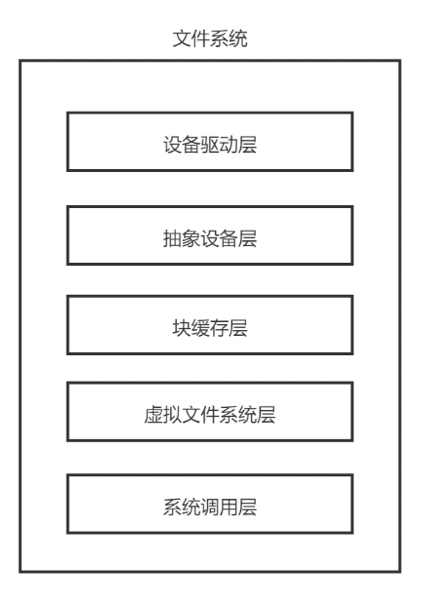

# 实验原理

在RISC-V中由bootloader来完成外设扫描，并包括物理内存在内的各种外设扫描将扫描结果以设备数二进制对象DTB（Device Tree Blob）的格式保存在物理内存中。扫描后遍历DTB即可得到设备树。

通常磁盘等真实的物理设备，为了保证读写的速度，通常以块为单位进行读写。通过设备数获得磁盘信息后，可以同抽象出驱动来实现一个块设备驱动器，以便于文件系统的搭建。

文件系统提供高效便捷的磁盘访问，以便系统和用户可以轻松的存储定位数据。其将驻留在外存上。用于组织文件的使用分配存储空间，恢复空闲空间、跟踪数据位置及操作系统其他部分与外层接口等。

